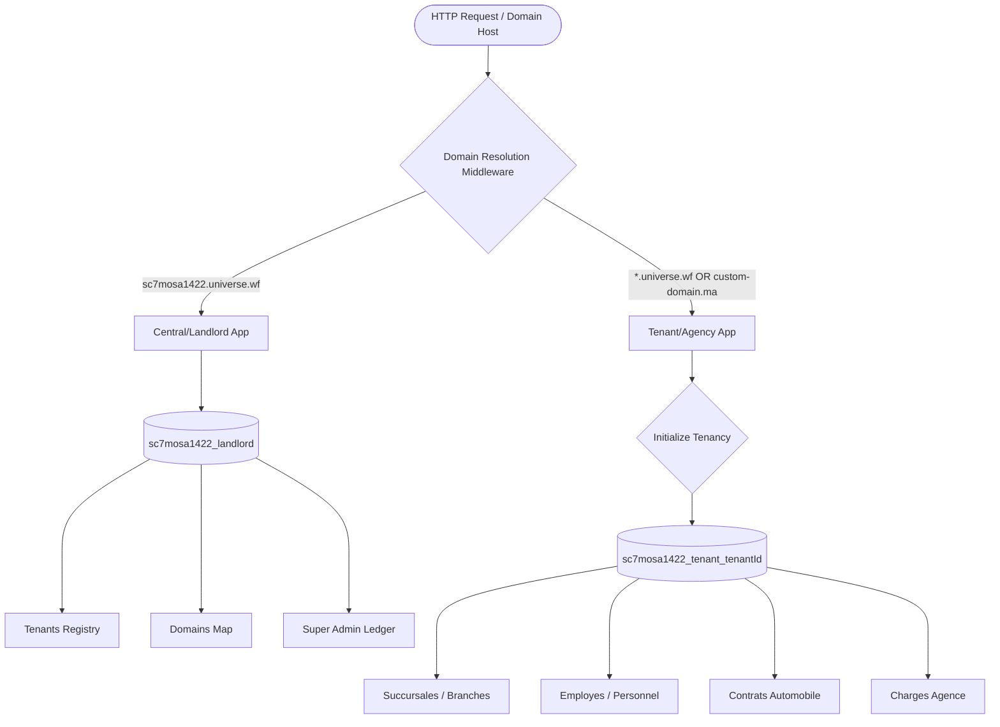

# Insurio — Plateforme de Gestion d'Assurances

Insurio est une plateforme SaaS moderne de gestion d'assurances conçue pour les cabinets et courtiers d'assurance. Elle permet de gérer des portefeuilles de contrats, les succursales locales, les employés, le calcul automatique de commissions, et le suivi des dépenses d'agence dans un environnement multi-tenant hautement personnalisable (White-Label).

## Fonctionnalités Principales

- **Multi-Tenancy** : Isolation complète des données des cabinets (Multi-Database via Stancl Tenancy).
- **Identité Visuelle & Personnalisation (White-Label)** : Modification des logos, favicons, et couleurs d'accentuation CSS par agence.
- **Gestion des Contrats** : Registre d'assurance complet, avenants, résiliations et calculs de primes proratisés.
- **Suivi Financier** : Gestion des commissions (agents et apporteurs) et des charges (loyer, charges, salaires).
- **Console Centrale Super Admin (Landlord Command Center)** : Dashboard Stripe-like avec MRR/ARR, factures, paiements, et télémétrie réseau en temps réel à travers 24 sous-modules.
- **CRM Client Profile (360° View)** : Profil interactif par client avec timeline, documents, paiements, et notes.
- **Moteur d'Automatisation Event-Driven** : Règles d'automatisation sur expiration de contrats (WhatsApp, email, tâches) avec commande CRON `platform:check-expirations`.
- **Copilot AI** : Assistant IA contextuel intégré au profil CRM (Gemini API + fallback offline).
- **Command Palette (Ctrl+K)** : Recherche globale instantanée de clients, contrats et pages depuis n'importe quel écran.

## Installation & Déploiement

Le déploiement est automatisé via `deploy.sh` sur les environnements configurés.

```bash
./deploy.sh
```

---

# Spécifications de l'Architecture & de la Base de Code

## 1. Vue d'ensemble de l'Architecture

La **Plateforme Insurio** est un système multi-tenant de gestion de cabinet d'assurance développé avec Laravel, Livewire, et Stancl Tenancy. Elle utilise un **modèle d'isolation multi-base de données** pour séparer la plateforme d'administration centrale (Landlord) des données de chaque agence d'assurance (Tenants).

### Conception Multi-Tenant (Multi-Database)


### Flux d'Initialisation & Routage
1. **Identification du Domaine** : Le middleware `InitializeTenancyByDomain` intercepte la requête HTTP.
2. **Résolution du Tenant** : Il vérifie l'hôte de la requête par rapport à la table centrale `domains`.
3. **Changement de Connexion DB** : Le gestionnaire de bases de données bascule automatiquement la connexion par défaut (`mysql`) vers la base isolée du cabinet résolu (`sc7mosa1422_tenant_tenantId`).
4. **Validation de l'Abonnement** : Le middleware `CheckTenantSubscription` vérifie l'état d'activation et redirige vers la vue d'expiration `/suspended` si l'abonnement du cabinet est expiré ou suspendu.
5. **Portée des Succursales (Branch Scoping)** : Dans le contexte du cabinet résolu, le scope SQL global `SuccursaleScope` restreint les requêtes d'assurance (contrats, clients, dépenses, employés) à la succursale associée à l'employé connecté.

---

## 2. Carte des Répertoires du Projet

```directory
├── app/
│   ├── Console/
│   │   └── Commands/
│   │       └── CheckContractExpirations.php  # CRON: vérification multi-tenant des contrats expirants
│   ├── Events/
│   │   └── ContractExpiringEvent.php         # Événement déclenché par le moteur d'automatisation
│   ├── Http/
│   │   ├── Controllers/
│   │   │   └── Platform/       # Contrôleurs Landlord (Console centrale, Impersonation)
│   │   │       ├── AuthController.php
│   │   │       ├── DashboardController.php   # Métriques MRR/ARR + showModule()
│   │   │       └── ExpenseController.php
│   │   └── Middleware/
│   │       └── CheckTenantSubscription.php    # Middleware de blocage d'abonnement
│   ├── Listeners/
│   │   └── ContractExpiringListener.php      # Invoque AutomationService sur événement
│   ├── Livewire/
│   │   ├── Admin/              # Gestion d'agence au niveau Tenant (Livewire)
│   │   │   ├── AdminDashboard.php            # CEO Dashboard (revenus, rétention, top agents)
│   │   │   ├── AutomationControl.php         # Dashboard des règles d'automatisation
│   │   │   ├── ClientProfile.php             # CRM 360° View + Copilot AI
│   │   │   ├── GestionAgence.php
│   │   │   ├── GestionCharges.php
│   │   │   ├── GestionCommissions.php
│   │   │   ├── GestionEmployes.php
│   │   │   └── GestionSuccursales.php
│   │   ├── Automobile/         # Opérations d'assurance automobile
│   │   │   ├── FormulaireContrat.php
│   │   │   └── ListeContrats.php
│   │   └── GlobalCommandPalette.php          # Ctrl+K recherche globale
│   ├── Models/
│   │   ├── Landlord/           # Modèles de base de données centrale
│   │   │   ├── FeatureFlag.php
│   │   │   ├── Invoice.php
│   │   │   ├── PlatformActivityLog.php
│   │   │   ├── PlatformAdmin.php
│   │   │   ├── PlatformExpense.php
│   │   │   ├── PlatformPayment.php
│   │   │   ├── PlatformWebhook.php
│   │   │   ├── Subscription.php
│   │   │   ├── SupportTicket.php
│   │   │   └── SystemBackup.php
│   │   ├── Scopes/
│   │   │   └── SuccursaleScope.php
│   │   ├── AutomationRule.php                # Règle d'automatisation (trigger + actions)
│   │   ├── Client.php
│   │   ├── ContratAuto.php
│   │   ├── Employe.php
│   │   ├── Reglement.php
│   │   ├── Succursale.php
│   │   ├── Tenant.php
│   │   └── User.php
│   ├── Providers/
│   ├── Services/
│   │   ├── AiCopilotService.php              # Bridge Gemini API + fallback offline
│   │   └── AutomationService.php             # Exécution multi-actions (WhatsApp, email, tâche)
│   └── Tenancy/
│       └── CPanelMySQLDatabaseManager.php
│
├── database/
│   ├── migrations/             # Migrations Landlord
│   │   ├── 2019_09_15_000010_create_tenants_table.php
│   │   ├── 2019_09_15_000020_create_domains_table.php
│   │   ├── 2026_07_20_000003_create_platform_expenses_table.php
│   │   ├── 2026_07_20_000004_create_agency_expenses_table.php
│   │   └── 2026_07_20_170000_create_landlord_billing_and_support_tables.php
│   └── migrations/tenant/      # Migrations Tenant
│       ├── 2026_07_20_000001_create_succursales_and_employes_tables.php
│       ├── 2026_07_20_000004_create_agency_expenses_table.php
│       └── 2026_07_20_170100_create_automation_rules_table.php
│
├── resources/views/
│   ├── errors/
│   │   └── suspended.blade.php
│   ├── layouts/
│   │   ├── app.blade.php                     # Layout tenant (sidebar + command palette)
│   │   └── platform.blade.php                # Layout landlord (console centrale)
│   ├── livewire/
│   │   ├── admin/
│   │   │   ├── admin-dashboard.blade.php      # CEO Dashboard UI
│   │   │   ├── automation-control.blade.php   # Gestion des règles d'automatisation
│   │   │   ├── client-profile.blade.php       # CRM 360° + Copilot AI drawer
│   │   │   └── gestion-charges.blade.php
│   │   ├── global-command-palette.blade.php   # Ctrl+K modal de recherche
│   │   └── layout/
│   │       └── navigation.blade.php
│   └── platform/
│       ├── dashboard.blade.php               # Console centrale Stripe-like
│       ├── module.blade.php                  # Template dynamique pour les 24 sous-modules
│       ├── tenants/
│       │   └── edit.blade.php
│       └── expenses/
│           └── index.blade.php
│
├── routes/
│   ├── web.php                 # Routes centrales + /super-admin/module/{moduleName}
│   └── tenant.php              # Routes isolées + /admin/automation + /admin/clients/{id}
│
├── tests/Feature/
│   ├── AdministrationTest.php
│   ├── AutomationEngineTest.php              # Tests du moteur d'automatisation
│   └── PlatformTest.php
│
├── documentation/              # Historique détaillé des mises à jour
│   ├── changelog-2026-07-20.md
│   └── changelog-2026-07-21.md
│
└── deploy.sh                   # Script de déploiement automatique sur cPanel
```

---

## 3. Dictionnaire de Données & Schémas

### Base de données Centrale (Landlord)

#### 1. `tenants`
Enregistre les cabinets d'assurance et leurs paramètres d'abonnement.
*   `id` (string, clé primaire) - Identifiant unique servant pour le sous-domaine par défaut.
*   `name` (string) - Raison sociale de l'agence.
*   `plan` (string) - `gratuit`, `premium`, `entreprise`.
*   `status` (string) - `active`, `suspended`, `trial`.
*   `subscription_start_date` (date, nullable)
*   `subscription_end_date` (date, nullable)
*   `rent_amount` (decimal, nullable) - Montant de la licence mensuelle en DH.
*   `logo_path` (string, nullable) - Logo personnalisé du cabinet (White-Label).
*   `favicon_path` (string, nullable) - Favicon personnalisée du cabinet (White-Label).
*   `couleur_primaire` (string, nullable) - Couleur principale CSS en code Hex (ex: `#0EA5A9`).

#### 2. `domains`
Cartographie des sous-domaines et des domaines personnalisés.
*   `id` (integer, clé primaire)
*   `domain` (string, unique) - Ex: `axamaarif.sc7mosa1422.universe.wf` ou `axasuc.ma`.
*   `tenant_id` (string, clé étrangère -> `tenants.id`)
*   `dns_status` (string) - État de validation DNS (`pending`, `verified`).

#### 3. `platform_expenses`
Registre comptable des charges de la plateforme centrale (Super Admin).
*   `id` (integer, clé primaire)
*   `title` (string) - Description de la charge.
*   `category` (string) - Ex: Hébergement, Marketing, Licences de développement.
*   `amount` (decimal) - Montant débité en DH.
*   `expense_date` (date)

---

### Base de données Cabinets (Tenant)

#### 1. `succursales`
Bureaux physiques de l'agence.
*   `id` (integer, clé primaire)
*   `code_succursale` (string, unique)
*   `nom` (string)
*   `ville` (string)
*   `adresse` (string)
*   `telephone` (string)
*   `domain` (string, nullable, unique) - Domaine configuré directement pour cibler cette succursale.

#### 2. `agency_expenses`
Registre comptable des charges locales de l'agence.
*   `id` (integer, clé primaire)
*   `title` (string) - Description de la charge.
*   `category` (string) - `loyer`, `electricite`, `eau`, `salaire`, `autre`.
*   `amount` (decimal) - Montant de la charge en DH.
*   `date_charge` (date)
*   `succursale_id` (integer, clé étrangère -> `succursales.id`)

#### 3. `contrats_auto`
Contrats d'assurance automobile émis.
*   `id` (integer, clé primaire)
*   `numero_contrat` (string)
*   `police` (string)
*   `prime_rc` (decimal) - Partie Prime Responsabilité Civile.
*   `prime_totale` (decimal) - Montant total payé par le client.
*   `succursale_id` (integer, clé étrangère -> `succursales.id`)
*   `statut` (string) - `actif`, `resilie`, `expire`.

---

## 4. Règles de Sécurité & Frontières Logiques

### 1. Contrôle des Suspensions
Vérifié par le middleware [CheckTenantSubscription.php](file:///Users/salim/Downloads/asusrence/app/Http/Middleware/CheckTenantSubscription.php) :
```php
if ($tenant->status === 'suspended') {
    return response()->view('errors.suspended', [], 403);
}
if ($tenant->subscription_end_date && now()->greaterThan($tenant->subscription_end_date)) {
    $tenant->update(['status' => 'suspended']);
    return response()->view('errors.suspended', [], 403);
}
```

### 2. Isolation Inter-Succursales
Intégré de façon transparente via [SuccursaleScope.php](file:///Users/salim/Downloads/asusrence/app/Models/Scopes/SuccursaleScope.php) :
Restreint automatiquement les données affichées (contrats, clients, dépenses, employés) à la succursale d'affectation de l'utilisateur connecté, excepté pour les rôles administratifs centraux (`super-admin`, `agency-admin`) qui bénéficient d'un accès global.
```php
$builder->where('succursale_id', $employe->succursale_id);
```

---

## 5. Principaux Registres de Routes

### Portail Central (Landlord)
*   `GET /super-admin/dashboard` - Console centrale Super Admin (métriques MRR/ARR).
*   `GET /super-admin/module/{moduleName}` - Accès aux 24 sous-modules (agences, abonnements, factures, etc.).
*   `GET /super-admin/tenants/{tenantId}/modifier` - Paramètres de licence et attribution de domaines de succursales.
*   `POST /super-admin/tenants/{tenantId}/succursales` - Ajout et provisionnement direct d'une succursale.
*   `GET /super-admin/charges` - Registre comptable central de la plateforme.

### Espaces Agences (Tenant)
*   `GET /dashboard` - CEO Dashboard (revenus, rétention, top agents, top produits).
*   `GET /admin/charges` - Interface Livewire de comptabilité locale.
*   `GET /admin/clients/{id}` - Profil CRM 360° du client (avec Copilot AI).
*   `GET /admin/automation` - Gestion des règles d'automatisation.

### Raccourcis Clavier
*   `Ctrl+K` / `Cmd+K` - Command Palette (recherche globale clients, contrats, pages).

---

## Historique des Mises à Jour (Changelog)

Les modifications importantes de la plateforme sont suivies par date :
*   **[21 Juillet 2026]** : Transformation majeure d'Insurio en Operating System d'assurance — Console centrale Stripe-like (MRR/ARR, 24 modules), CEO Dashboard avancé, CRM 360° avec profil client interactif, moteur d'automatisation event-driven, Copilot AI (Gemini API), et Command Palette globale (Ctrl+K). 71 tests passés, 274 assertions. Voir le rapport détaillé : [changelog-2026-07-21.md](documentation/changelog-2026-07-21.md).
*   **[20 Juillet 2026]** : Corrections de bugs de production (variables indéfinies, typages, MySQL Central), optimisation du positionnement du badge de notification, configuration complète de Corbell AI (49k+ méthodes graphées), nettoyage de la barre d'actions du registre Automobile, ajout d'alertes visuelles et de filtres pour les contrats expirant dans moins de 7 jours. Voir le rapport détaillé : [changelog-2026-07-20.md](documentation/changelog-2026-07-20.md).

---

## Licence

Insurio est un logiciel propriétaire. Tous droits réservés.
